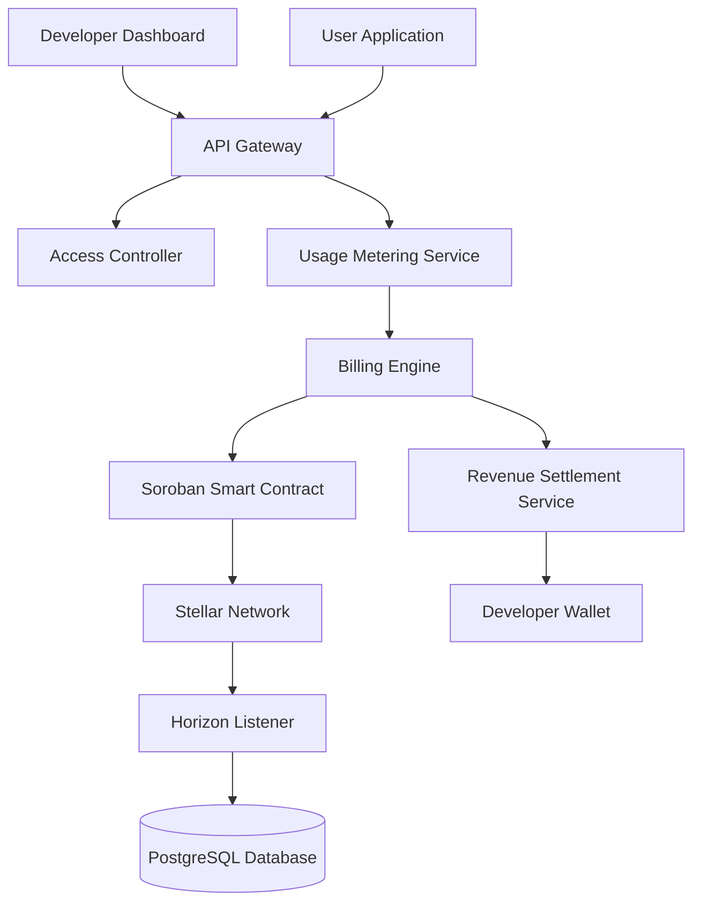

# Callora

## Programmable Access

---

## 1. Overview

Callora is an on-chain API marketplace built on the Stellar network that enables developers to monetize APIs through pay-per-call billing in USDC.

The platform provides:

- API publishing infrastructure
- On-chain micro-payment settlement
- Usage metering
- Secure access control
- Transparent revenue distribution

Callora functions as a Web3-native API monetization layer where access to digital services is programmable and settled in real time using Stellar.

---

## 2. Problem Statement

Traditional API monetization systems rely on:

- Credit cards and Stripe billing
- Monthly subscription bundles
- Centralized billing providers
- Delayed settlements
- High payment processing fees

**Limitations:**

- Micro-transactions below $0.01 are inefficient
- Developers in restricted regions face payment barriers
- Usage-based billing requires complex backend infrastructure
- Settlement and reconciliation are opaque

There is no decentralized infrastructure for programmable API monetization using micro-payments.

---

## 3. Solution

Callora introduces a **prepaid access vault** model:

- Developers publish APIs with pricing defined per request
- Users deposit USDC into an on-chain vault
- Each API call deducts balance programmatically
- Access tokens are issued dynamically
- Usage is verifiable and transparent

The system combines smart contracts, off-chain metering, and API gateway enforcement.

---

## 4. High-Level Architecture

---

## 5. Repositories

| Repo | Description |
|------|-------------|
| [callora-frontend](callora-frontend/) | Developer dashboard and user-facing web app |
| [callora-backend](callora-backend/) | API gateway, metering, and billing services |
| [callora-contracts](callora-contracts/) | Soroban smart contracts for vault and settlement |

Each repository has its own README with local setup instructions.
